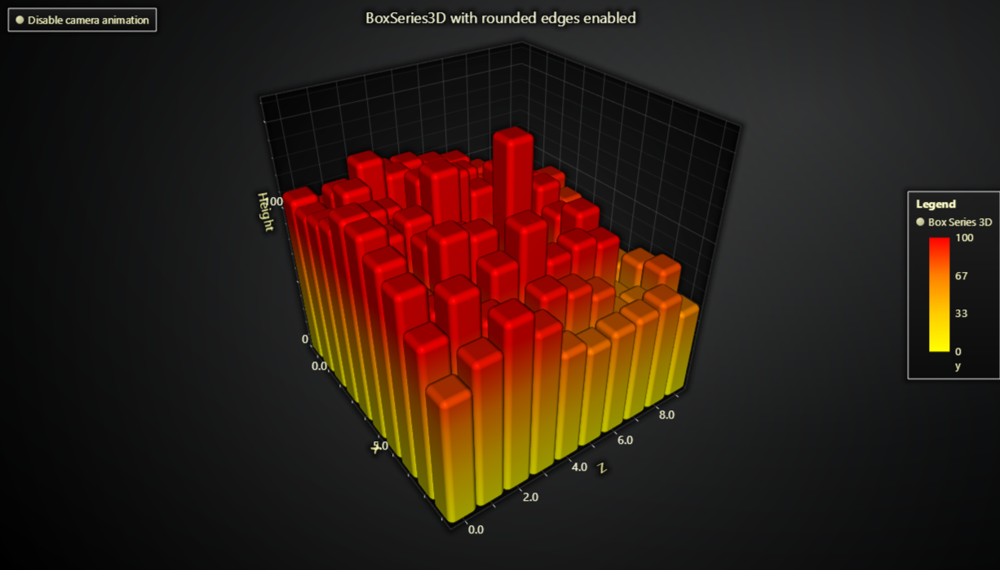

# JavaScript 3D Box Series rounded edges



This demo application belongs to the set of examples for LightningChart JS, data visualization library for JavaScript.

LightningChart JS is entirely GPU accelerated and performance optimized charting library for presenting massive amounts of data. It offers an easy way of creating sophisticated and interactive charts and adding them to your website or web application.

The demo can be used as an example or a seed project. Local execution requires the following steps:

-   Make sure that relevant version of [Node.js](https://nodejs.org/en/download/) is installed
-   Open the project folder in a terminal:

          npm install              # fetches dependencies
          npm start                # builds an application and starts the development server

-   The application is available at _http://localhost:8080_ in your browser, webpack-dev-server provides hot reload functionality.


## Description

This example shows an animated 3D Bar Chart with bars coloured dynamically based on their height.

The Chart is rendered using `BoxSeries3D`, a series type capable of rendering any number of Boxes as well as allowing individual full level modification (location, size, color) at any point during runtime.

The example also showcases the rounded edges feature. While enabled by default, it can be adjusted and disabled at any time with `BoxSeries3D.setRoundedEdges`

## BoxSeries3D data format

`BoxSeries3D` supports input data in two different formats, namely:

-   `BoxDataCentered` (specify Box center coordinate and size)
-   `BoxDataBounds` (specify Box start and end coordinates)

On top of this _geometry_ information, one can also supply the following optional properties:

-   **id**:
    -   By supplying an ID, the Boxes' properties can be modified later (by passing the same _id_).
    -   When modifying a previously added Box, **all** properties (other than _id_) are optional (supplied properties are overridden).

```typescript
// Initial Box definition (BoxDataCentered format).
BoxSeries3D.invalidateData([
    {
        xCenter: 0,
        yCenter: 0,
        zCenter: 0,
        xSize: 1,
        ySize: 1,
        zSize: 1,
        id: 'box-#0',
    },
])
// Modify 'yCenter' property only.
BoxSeries3D.invalidateData([
    {
        id: 'box-#0',
        yCenter: 5,
    },
])
```

-   **color**:
    -   Assigns a _Color_ to the Box to be used when individual coloring mode is enabled.

```typescript
// Add Boxes with individual Colors.
BoxSeries3D.invalidateData([{
    ...,
    color: ColorRGBA( 255, 0, 0 )
}])
// Enable individual coloring mode.
BoxSeries3D.setFillStyle( new IndividualPointFill() )
```

-   **value**:
    -   Assigns a _look-up value_ to the Box to be used when look-up coloring mode is enabled.

```typescript
// Define Color Look-Up-Table.
const lut = new LUT( {
    steps: [
        { value: 0, color: ColorRGBA( 0, 0, 0 ) },
        { value: 100, color: ColorRGBA( 255, 0, 0 ) }
    ],
    interpolate: true
} )
// Add Boxes with look up values.
BoxSeries3D.invalidateData([{
    ...,
    value: 50
}])
// Enable look up coloring mode
BoxSeries3D.setFillStyle( new PalettedFill({ lut }) )
```


## API Links

* [3D chart]
* [3D box series]
* [Box data centered]
* [Box data bounds]
* [Paletted Fill Style]
* [LUT]


## Support

If you notice an error in the example code, please open an issue on [GitHub][0] repository of the entire example.

Official [API documentation][1] can be found on [LightningChart][2] website.

If the docs and other materials do not solve your problem as well as implementation help is needed, ask on [StackOverflow][3] (tagged lightningchart).

If you think you found a bug in the LightningChart JavaScript library, please contact sales@lightningchart.com.

Direct developer email support can be purchased through a [Support Plan][4] or by contacting sales@lightningchart.com.

[0]: https://github.com/Arction/
[1]: https://lightningchart.com/lightningchart-js-api-documentation/
[2]: https://lightningchart.com
[3]: https://stackoverflow.com/questions/tagged/lightningchart
[4]: https://lightningchart.com/support-services/

© LightningChart Ltd 2009-2022. All rights reserved.


[3D chart]: https://lightningchart.com/js-charts/api-documentation/v5.1.0/classes/Chart3D.html
[3D box series]: https://lightningchart.com/js-charts/api-documentation/v5.1.0/classes/BoxSeries3D.html
[Box data centered]: https://lightningchart.com/js-charts/api-documentation/v5.1.0/interfaces/BoxDataCentered.html
[Box data bounds]: https://lightningchart.com/js-charts/api-documentation/v5.1.0/interfaces/BoxDataBounds.html
[Paletted Fill Style]: https://lightningchart.com/js-charts/api-documentation/v5.1.0/classes/PalettedFill.html
[LUT]: https://lightningchart.com/js-charts/api-documentation/v5.1.0/classes/LUT.html

